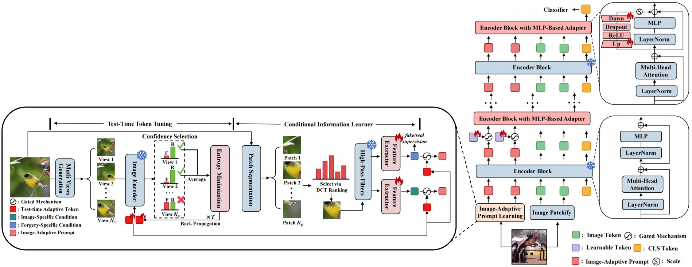

<div align="center">
<!-- <h1>RCTrans</h1> -->
<h3>Towards Generalizable AI-Generated Image Detection via Image-Adaptive Prompt Learning</h3>
<h4>Yiheng Li, Zicahng Tan, Zhen Lei, Xu Zhou and Yang Yang<h4>
<h5>MAIS&CASIA, UCAS, Sangfor<h5>
</div>

[](https://arxiv.org/abs/2508.01603)

## Introduction

This repository is an official implementation of IAPL, codes and weight will be released after paper accepted.

## Methods


## Visualization


## Results

| Benchmark |  mACC(%)  |  mAP(%)   | 
| :-------- | :---: | :---: |
| UniversalFakeDetect   | 95.61  | 99.32  |
| GenImage | 96.7  | 99.5  |

## Citation
```
@article{li2025towards,
  title={Towards Generalizable AI-Generated Image Detection via Image-Adaptive Prompt Learning},
  author={Li, Yiheng and Tan, Zichang and Lei, Zhen and Zhou, Xu and Yang, Yang},
  journal={arXiv preprint arXiv:2508.01603},
  year={2025}
```
